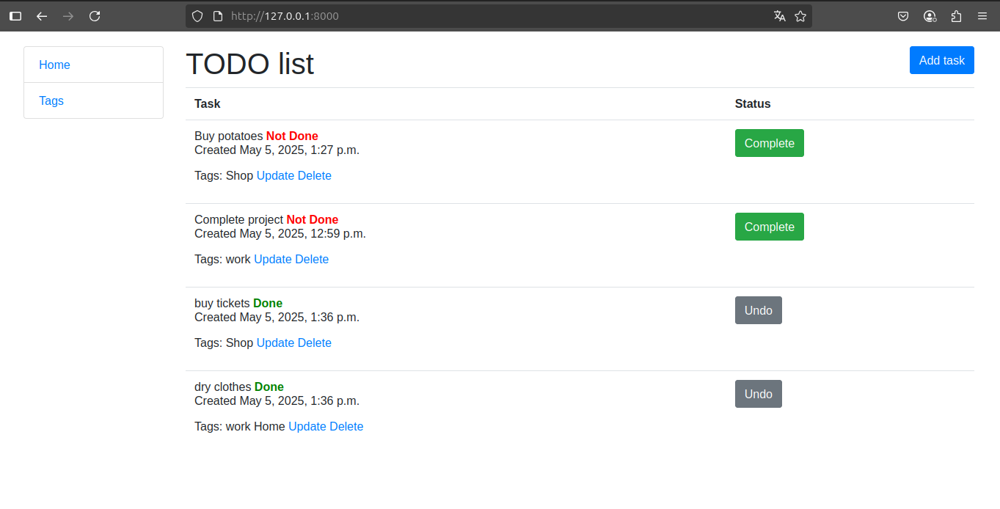

# todo

Convenient and flexible task manager


## Installing using GIT
```bash
   git clone https://github.com/Komar88lvl/todo.git
   cd todo
   python3 -m venv .venv
```

- Requirement installation:

## Linux/macOS:
```bash
  source .venv/bin/activate
  pip install -r requirements.txt
  touch .env
```

## Windows:
```bash
  source .venv\Scripts\activate
  pip install -r requirements.txt
  touch .env
```

Create DJANGO_SECRET_KEY and put in .env file


After .env settings:
```bash
  python manage.py migrate
  python manage.py runserver
```


## Features:
* Create, update, and delete tasks with tags
* Changing task status without deleting


## Demo

